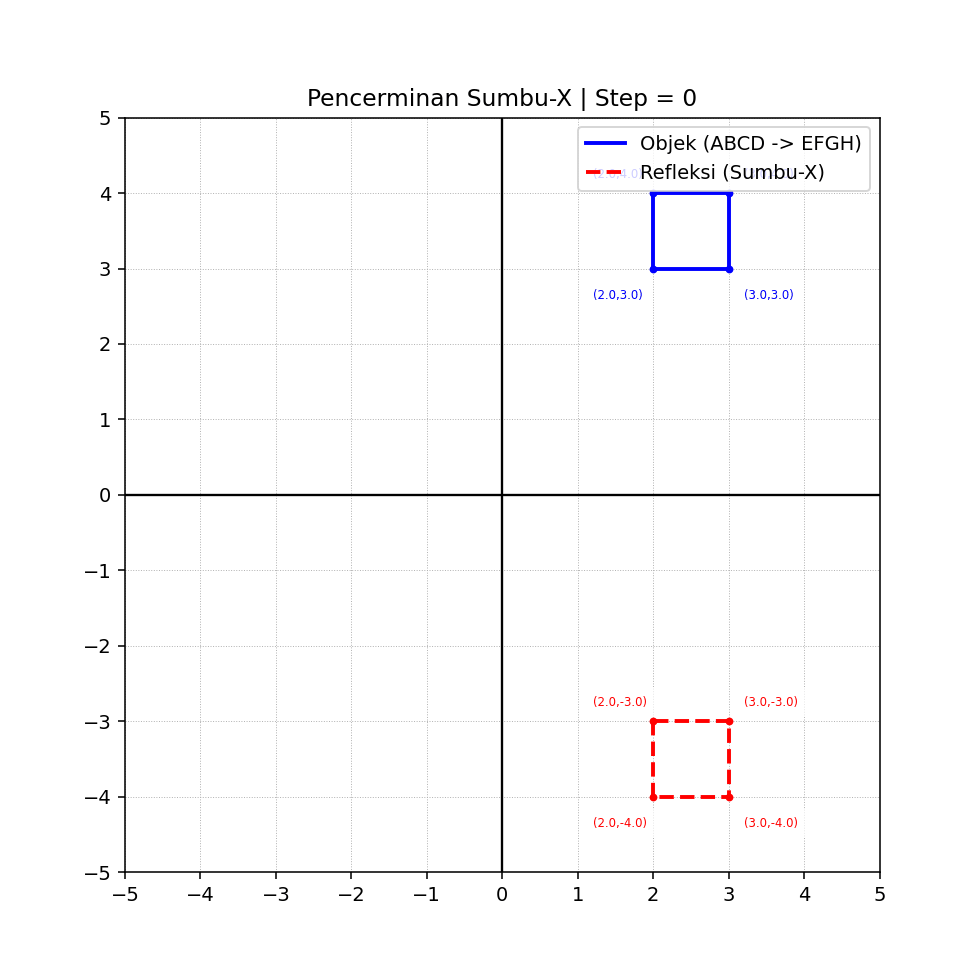

# Tranformasi

# Animasi Transformasi Geometri 2D (Translasi & Refleksi) Menggunakan Python
## 1. Gambaran Umum
Transformasi geometri merupakan konsep dasar dalam matematika dan komputasi grafis yang digunakan untuk mengubah posisi suatu objek tanpa mengubah bentuk aslinya. Dalam implementasi ini, sebuah bangun datar 2D dianimasikan menggunakan Python untuk memperlihatkan dua proses utama, yaitu translasi (pergeseran) dan refleksi (pencerminan terhadap sumbu-X) secara simultan.

Pendekatan ini memanfaatkan perhitungan matriks dan visualisasi dinamis sehingga proses transformasi dapat diamati secara bertahap, bukan hanya hasil akhirnya.

## 2. Representasi Objek dalam Bidang Koordinat
Objek yang digunakan berbentuk bangun segi empat (ABCD) yang direpresentasikan sebagai kumpulan titik:

A(2,3)

B(2,4)

C(3,4)

D(3,3)

Titik terakhir diulang agar bentuk tertutup dan dapat divisualisasikan sebagai poligon utuh.

Representasi ini penting karena setiap transformasi hanya bekerja pada koordinat titik-titik tersebut.

## 3. Konsep Transformasi yang Digunakan
### a. Translasi (Pergeseran)
Translasi adalah perpindahan objek dari satu posisi ke posisi lain tanpa mengubah ukuran atau bentuk.

$T =
\left[
\begin{array}{ccc}
1 & 0 & t_x \\
0 & 1 & t_y \\
0 & 0 & 1
\end{array}
\right]$

Dalam program:

Objek digerakkan secara vertikal
Nilai ty berubah secara bertahap dari 0 hingga nilai maksimum
Efeknya adalah objek terlihat "bergerak turun"

### b. Refleksi terhadap Sumbu-X
Refleksi adalah transformasi yang membalik posisi objek terhadap suatu garis acuan.

$R =
\left[
\begin{array}{cc}
1 & 0 \\
0 & -1
\end{array}
\right]$

Dampaknya:

Koordinat y berubah tanda (positif menjadi negatif atau sebaliknya)
Bentuk tetap sama, hanya posisi terbalik secara vertikal

## 4. Konsep Koordinat Homogen
Agar translasi dapat dilakukan menggunakan perkalian matriks, sistem koordinat diubah menjadi bentuk homogen:

(x, y) → (x, y, 1)

Keuntungan metode ini:

Translasi dapat dihitung menggunakan matriks
Memudahkan kombinasi beberapa transformasi sekaligus
## 5. Alur Transformasi dalam Animasi
Animasi bekerja berdasarkan frame (bingkai waktu). Setiap frame menjalankan langkah berikut:

### 1. Translasi Objek Asli
Objek utama digeser secara bertahap ke bawah.

### 2. Refleksi Objek
Objek dicerminkan terhadap sumbu-X terlebih dahulu.

### 3. Translasi Bayangan
Hasil refleksi juga ikut bergerak dengan arah berlawanan.

## 6. Visualisasi Menggunakan Matplotlib
Program menggunakan pustaka visualisasi untuk menampilkan hasil transformasi secara interaktif.

Komponen visual:

Garis biru → objek utama
Garis merah putus-putus → bayangan refleksi
Grid → membantu membaca koordinat
Label → menunjukkan nilai koordinat setiap titik

Selain itu, fungsi animasi membuat pergerakan objek terlihat halus dan berurutan.
### Code

```python
import numpy as np
import matplotlib.pyplot as plt
from matplotlib.animation import FuncAnimation

# ==========================================
# OBJEK AWAL (ABCD) - Urutan memutar searah jarum jam
# ==========================================
objek = np.array([
    [2, 3],
    [2, 4],
    [3, 4],
    [3, 3],
    [2, 3]
])

# ==========================================
# TRANSFORMASI (Pencerminan terhadap Sumbu-X)
# ==========================================
R = np.array([
    [1,  0],
    [0, -1]
])

def T(tx, ty):
    return np.array([
        [1, 0, tx],
        [0, 1, ty],
        [0, 0, 1]
    ])

def ke_homogen(obj):
    return np.hstack((obj, np.ones((obj.shape[0], 1))))

def ke_cartesian(obj):
    return obj[:, :2]

# ==========================================
# LABEL KOORDINAT
# ==========================================
def gambar_label(points, warna, arah):
    if arah == 'atas':
        offsets = [
            (-0.8, -0.4),  # A
            (-0.8, 0.2),   # B
            (0.2, 0.2),    # C
            (0.2, -0.4)    # D
        ]
    else:  # Untuk bayangan di bawah sumbu-X
        offsets = [
            (-0.8, 0.2),
            (-0.8, -0.4),
            (0.2, -0.4),
            (0.2, 0.2)
        ]

    for i, (x, y) in enumerate(points[:-1]):
        dx, dy = offsets[i % 4]
        ax.plot(x, y, 'o', color=warna, markersize=3)
        ax.text(
            x + dx, y + dy,
            f"({x:.1f},{y:.1f})",
            fontsize=6,
            color=warna,
            bbox=dict(facecolor='white', alpha=0.7, edgecolor='none')
        )

# ==========================================
# SETUP PLOT
# ==========================================
plt.rcParams['figure.dpi'] = 140
fig, ax = plt.subplots(figsize=(7, 7))

total_frames = 15
max_translation = -2.0  # Bergerak turun sejauh 2 satuan (dari y=3 ke y=1)

def update(frame):
    ax.clear()

    # Grid & Limit Canvas
    ax.set_xlim(-5, 5)
    ax.set_ylim(-5, 5)
    ax.set_aspect('equal')

    # Sumbu utama
    ax.axhline(0, color='black', linewidth=1.2)
    ax.axvline(0, color='black', linewidth=1.2)

    # Grid rapat berurutan
    ax.set_xticks(np.arange(-5, 6, 1))
    ax.set_yticks(np.arange(-5, 6, 1))
    ax.grid(True, linewidth=0.5, linestyle=':')

    # ==========================================
    # PROSES GERAK (TRANSLASI & REFLEKSI)
    # ==========================================
    ty = (frame / (total_frames - 1)) * max_translation
    obj_h = ke_homogen(objek)

    # 1. Objek Asli: Turun Vertikal (ABCD -> EFGH)
    asli = (T(0, ty) @ obj_h.T).T
    asli = ke_cartesian(asli)

    # 2. Refleksi Awal di Sumbu-X
    refleksi_awal = (R @ objek.T).T
    refleksi_h = ke_homogen(refleksi_awal)

    # 3. Gerak Bayangan: Naik Vertikal (arahnya berlawanan)
    refleksi = (T(0, -ty) @ refleksi_h.T).T
    refleksi = ke_cartesian(refleksi)

    # Gambar Garis Objek & Bayangan
    ax.plot(asli[:, 0], asli[:, 1], 'b-', linewidth=2, label='Objek (ABCD -> EFGH)')
    ax.plot(refleksi[:, 0], refleksi[:, 1], 'r--', linewidth=2, label='Refleksi (Sumbu-X)')

    # Berikan Label Koordinat dinamis
    gambar_label(asli, 'blue', 'atas')
    gambar_label(refleksi, 'red', 'bawah')

    ax.legend(loc='upper right')
    ax.set_title(f"Pencerminan Sumbu-X | Step = {frame}")

# Membuat Animasi (Gunakan repeat=True agar animasi terus berulang otomatis)
anim = FuncAnimation(fig, update, frames=total_frames, interval=300, repeat=True)

# Tampilkan langsung jendela interaktif di VS Code
plt.show()

```
### Visualisasi


## 7. Mekanisme Animasi

Animasi dibuat menggunakan pendekatan frame-based:

Setiap frame mewakili satu langkah perubahan
Nilai translasi dihitung ulang setiap frame
Fungsi update() bertanggung jawab memperbarui tampilan grafik

Hasilnya adalah simulasi pergerakan objek yang realistis dan dinamis.

## 8. Keterkaitan dengan Konsep Matematika

Implementasi ini menggabungkan beberapa konsep penting:

Matriks transformasi
Koordinat Kartesius
Vektor 2D
Fungsi linear dalam perubahan posisi

Hal ini menunjukkan bahwa matematika dapat langsung diterapkan dalam pemrograman grafis modern.